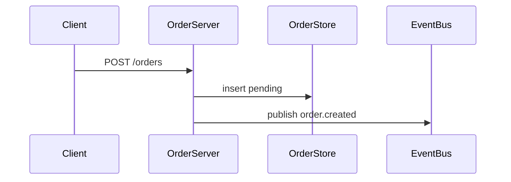

# Schema decision guide — `flow.json` + `style.json`

The on-disk format is split into two files per flow, both nested inside
the owning flow's folder under `<repoPath>/flows/<flowSlug>/`:

- **`flow.json`** — pure semantic data (ids, types, names, kinds, actions,
  connector sources / targets / labels). The studio rejects every
  presentation field server-side on each write.
- **`style.json`** — every presentation field (positions, handles,
  borders, colors, sizes, fonts, connector style/direction/path).
  **Studio-owned end-to-end.** The skill never authors it directly —
  `seeflow flows:layout --project <projectSlug> --flow <flowSlug>` runs
  ELK and writes positions / handles, and the canvas writes user-drag
  and per-node visual overrides. The renderer applies sensible defaults
  (1 px solid border in the default theme color) when a style entry is
  absent, so the skill leaves visuals out and the canvas paints
  correctly.

The merged ResolvedFlow over the API
(`GET /api/projects/:project/flows/:flow`) is the flow + style baked
together.

## Look up the contract at runtime — never memorise it

**The CLI is the only source of truth for field shapes.** This file
documents conventions, file layout, and when-to-use guidance — it does
**not** document fields, types, or enum values. **Before designing or
authoring any node, run the schema CLI** — Phase 0 caches the payload
for the orchestrator, and Phase 2 (planner) / Phase 4 (designers)
re-drill into specific variants as they compose patches. If a field
name, type, required-list, or enum value is not in `$SEEFLOW schema`,
it does not exist.

### Progressive workflow (run these before designing nodes)

The CLI is built for cheap progressive disclosure — start broad, drill
narrow, then `--jq` to a single field. Each level enriches the response
with affordances the next step needs:

    # 1. See the whole catalog.
    $SEEFLOW schema
    #    → { categories: [{ name, description, subnames: [...] }, …],
    #        usage: { drill, filter, examples },
    #        jqHints: { rootPath: '.categories', examples, tip } }
    #    Every category surfaces its drill targets inline under
    #    `categories[].subnames` so you never need a second listing call.

    # 2. Drill into one category for the full variant tree.
    $SEEFLOW schema flow             # top-level envelope
    $SEEFLOW schema node             # every node variant
    $SEEFLOW schema connector        # every connector variant
    $SEEFLOW schema action           # every action variant
    $SEEFLOW schema componentSpec    # spec.json shape for type:'component'
    $SEEFLOW schema componentCatalog # every legal componentSpec.elements[].type
                                     # + the props each accepts (one subname
                                     # per component: Card, Chart, Table, …)
    $SEEFLOW schema style            # style.json envelope (for reference)
    #    → { name, schemas, notes, subnames: [...],
    #        jqHints: { examples: [...], rootPath: '.schemas', tip } }
    #    `subnames` is the legal drill list; `jqHints.examples` are
    #    copy-paste jq paths to feed back as `--jq` on the next call;
    #    `jqHints.rootPath` is the prefix `--jq` filters root at.

    # 3. Drill into one variant for one shape — the fastest read.
    $SEEFLOW schema node rectangle
    $SEEFLOW schema node component
    $SEEFLOW schema node image
    $SEEFLOW schema action playAction
    $SEEFLOW schema componentSpec componentSpecElement
    $SEEFLOW schema componentCatalog Chart   # just Chart's props schema
    #    → { name, subname, schemas, notes,
    #        jqHints: { dataFields: [...], examples: [...],
    #                   rootPath: '.schemas.<subname>', tip } }
    #    `jqHints.dataFields` is the per-variant `data.<field>` list —
    #    EXACTLY the names you can paste under
    #    `.schemas.<subname>.properties.data.properties.<field>` to pull
    #    one field's contract with `--jq`. `jqHints.examples`
    #    pre-builds those paths for the variant.

The category-level `notes` ride along unchanged because the cross-
variant invariants still apply when you're looking at one variant.
Unknown subnames exit 3 with `code:"notFound"` plus an `available` list
of valid subnames for the category.

### Slicing with `--jq`

Pass `--jq <filter>` to extract just the slice you need inside the CLI
instead of post-processing the JSON in this orchestrator. Supported
subset is a jq-path grammar (identity `.`, field access `.foo`, bracket
access `.["foo"]` / `.[3]` / negative indices, iteration `.foo[]`,
optional `?`, pipe `|`). Single-output filters return `{ result:
<value> }`; multi-output filters (from `[]` or `|`) return `{ result:
[<v1>, …] }`. Bad filters exit 2 with `code:"badJq"`.

**Canonical pattern:** drill in with `subname`, then `--jq` straight to
the `data.<field>` the planner or designer is about to set, using one
of the paths the CLI listed in `jqHints.examples`:

    $SEEFLOW schema node rectangle \
        --jq '.schemas.rectangle.properties.data.properties.playAction'

    $SEEFLOW schema node component \
        --jq '.schemas.component.properties.data.properties.spec'

    $SEEFLOW schema action playAction \
        --jq '.schemas.playAction.required'

`jqHints.dataFields` is the answer to "what fields can I jq for?" —
for any node variant it lists every `data.<field>` you can target.
Non-node variants (action, connector, componentSpec, style) have no
`data` wrapper, so `dataFields` is absent on those responses; use
`jqHints.examples` instead.

If `--jq` returns `badJq` it means the path is wrong, **not** that the
tool is broken — re-run the parent (`$SEEFLOW schema node rectangle`)
without `--jq`, read `jqHints.examples` / `jqHints.dataFields` for the
correct path, then retry. Never switch to in-process JSON parsing.

Run `$SEEFLOW help schema` for the authoritative grammar and live
examples; the response of every schema call also carries the relevant
hints inline.

Each call returns the contract per variant plus a `notes` array
carrying cross-field invariants the contract can't express, plus the
`subnames` / `jqHints` affordances above. The same output (with the
same `subnames`, `usage`, and `jqHints` fields) is reachable over MCP
(`seeflow_schema` — accepts `name` and `subname`) and REST (`GET
/api/schema[/:name[/:subname]]`) — pick whichever transport you're
already on. The Phase 0 cache is forwarded to the node-planner (Phase
2) and the play/status designers (Phase 4) in their launching prompts;
downstream agents never re-fetch the whole category but ARE expected
to re-drill into a single subname (with `--jq` for a single field)
when composing patches.

Do not infer a field shape from this file, from the agent prompts, or
from older skill memory — read the cached answer.

## Skill-known node types

The skill's docs reference these 13 `type` discriminator values. Phase 0
diffs this list against `$SEEFLOW schema node`'s actual variants as a
silent maintainer signal — the install is either ahead of the skill
(extra types) or behind it (missing types). The diff has no runtime
effect; the planner uses whatever types the CLI actually accepts.

```
rectangle  ellipse  sticky  text  database  server  user
queue      cloud    icon    html  image     component
```

If you add a new node type to the skill docs, append it here so the
Phase 0 diff stays accurate. Removing a type the CLI still exposes
isn't an error — the diff just nudges the maintainer that the skill
fell behind.

## Per-node file convention

Node and connector ids in `flow.json` are canonical `node-<10 base62>` /
`conn-<10 base62>` form, generated by `$SEEFLOW ids <node|connector> <count>`
(skill side) or `apps/studio/src/short-id.ts` (canvas + server side; both
share the alphabet + rejection-sampling logic). Every file owned by a
node lives under the owning flow's folder at
`<repoPath>/flows/<flowSlug>/nodes/<nodeId>/`:

```
<repoPath>/
├── seeflow.json                ← project manifest (project metadata + flows[])
└── flows/
    └── <flowSlug>/
        ├── flow.json
        ├── style.json
        └── nodes/
            └── <nodeId>/
                ├── detail.md          # auto-externalized from data.detail
                ├── view.html          # auto-externalized from data.html (type:'html')
                └── scripts/
                    ├── play.ts
                    └── status.ts
```

Action `scriptPath` values are **relative to the node folder** — no
`flows/<flowSlug>/` prefix, no `nodes/<id>/` prefix. The studio's
resolver prepends `<repoPath>/flows/<flowSlug>/nodes/<nodeId>/` and
rejects any path that escapes the node folder (`..`, absolute).
Deleting the node cascade-deletes the whole folder — no stranded
scripts. For the exact shape of any action, run `$SEEFLOW schema action`.

## `file://` substitution

`detail` and `html` content in `flow.json` are auto-externalised by the
studio on any write. Pass the raw content as a string to `seeflow
nodes:add` / `seeflow nodes:patch`; the studio writes it to
`<repoPath>/flows/<flowSlug>/nodes/<id>/detail.md` (or `view.html`) and
persists a `file://` ref on disk. Reads inline it back to the actual
string. Empty string clears the file but keeps the ref.

Hand-authored `file://<relative-path>` strings still work for
forward-compat; the path must be relative under the owning flow's
folder (`flows/<flowSlug>/`), no leading `/`, no `..`. Missing files
render as a `[seeflow: missing file '…']` placeholder card.

## `flow.json` envelope

For the envelope shape, run `$SEEFLOW schema flow`. Two runtime points
the schema can't express:

- The envelope's optional reset action exists only when the app has a
  "wipe state" entrypoint — author it only if one exists. Its
  `scriptPath` is anchored at the flow folder (`flows/<flowSlug>/`);
  per-node anchor is a deferred follow-up.
- Author the empty envelope at scaffold time using whatever `$SEEFLOW
  schema flow` says is required — never paste a hardcoded shape from
  memory or this file. `projects:create` writes the empty envelope for
  you at `<repoPath>/flows/main/flow.json` plus the manifest at
  `<repoPath>/seeflow.json` in one shot.

## `style.json` envelope (studio-owned)

Written exclusively by
`seeflow flows:layout --project <projectSlug> --flow <flowSlug>` (ELK)
and by user drags in the canvas. Positions and handles are derived
geometrically. **The skill never writes this file.** For the on-disk
shape, run `$SEEFLOW schema style` — but only for inspection; never
author it.

## When to use which node type

For the exact field shape of each variant, run `$SEEFLOW schema node`.
This section is the **decision guide** — what each variant is for and
when to pick it. Pair it with the live schema before composing any
patch body.

The schema is **flat**: `type` is the visual shape (one of 12 tags),
and `playAction` / `statusAction` / `stateSource` are top-level data
fields valid on every type. There is no separate "play node" or
"state node" tag — capabilities live on `data` regardless of shape,
and the canvas renders chrome on `rectangle` (inline header) plus the
illustrative shapes (`database`, `server`, `user`, `queue`, `cloud`)
via a bottom skirt.

### Capabilities — top-level data fields on every type

| Capability | What it does | Renders chrome on |
|---|---|---|
| `data.playAction` | Adds a clickable Play button that runs the configured action. | `rectangle` (inline header) + illustrative shapes (`database`, `server`, `user`, `queue`, `cloud`) via a bottom skirt |
| `data.statusAction` | Adds a status pill driven by a long-running probe script. | Same surfaces as `playAction` |
| `data.stateSource` | Informational metadata about where state comes from. Pair with `statusAction` when relevant — optional everywhere. | (no chrome) |

**Capability chrome surfaces on the matching SEMANTIC shape — pick the
shape, don't fall back to `rectangle`.** The renderer draws Play
buttons / status badges in two places:

- **`rectangle`** — chrome lives inside the header strip (Play button
  next to the name, status pill on the right). Use for named
  services, HTTP endpoints, workers — anything without a better
  matching shape.
- **Illustrative shapes** (`database`, `server`, `user`, `queue`,
  `cloud`) — chrome lives in a bottom **skirt** below the SVG icon
  (see `packages/canvas/src/nodes/geometric-node.tsx`'s
  `showSkirt = isIllustrativeShape(shape) && (hasPlayCapability || hasStatusReport)`).
  Use these whenever the visual matches the entity — a Postgres
  database is `type:'database'`, NOT `type:'rectangle'` with
  `data.icon:'database'`.

Decorative shapes (`ellipse`, `sticky`, `text`, `icon`, `image`) draw
NO capability chrome. Putting a `playAction` on them is legal at the
schema layer but the user can't click it — don't.

**Shape-selection rule:** the shape carries meaning. If a node IS a
database, queue, file/object store, event bus, external SaaS, server,
or human actor, use the matching illustrative shape; only fall back to
`rectangle` when no illustrative shape fits (HTTP endpoints, workers,
schedulers, services, generic processes).

### `rectangle`

The named card with a header (name + optional icon), description, body,
and capability chrome. Use for important nodes that **don't have a
matching illustrative shape** — HTTP endpoints, microservices, workers,
schedulers, generic processes. When the entity IS a database / queue /
external SaaS / server / human, prefer the matching illustrative shape
below.

**RULE — detail on important nodes:** Every node that carries
`playAction` or `statusAction` MUST include a `detail` field
(regardless of shape — `rectangle` or illustrative). The content
renders as **markdown** — use it to explain what the node does, what
it emits, why it matters, sample payloads, links to source files, or
anything an audience member would ask. Decorative shapes (sticky, text,
icon) are exempt.

The markdown also renders fenced **` ```mermaid `** blocks inline as
SVG (the detail panel upgrades `language-mermaid` code fences to a live
diagram; a bad diagram falls back to the raw source). For anything an
audience would struggle to follow in prose — a sequence of calls, a
state machine, a fan-out/fan-in, a request lifecycle — prefer a mermaid
diagram (`sequenceDiagram`, `stateDiagram-v2`, `flowchart`) over a long
paragraph. Keep the prose for the "why"; let the diagram carry the
structure. Embed the fence directly in the `detail` string:

````markdown
## Order Server

Accepts a cart, writes a pending order, publishes `order.created`.


````

**RULE — icon on rectangle nodes:** Every `rectangle` that carries
`playAction` or `statusAction` SHOULD include an icon — a kebab-case
Lucide icon name (`server`, `radio-tower`, `cog`, `clock`,
`terminal`) that visually echoes the node's role. Renders left of the
name. Decorative; not a status indicator. Illustrative shapes
(`database`, `server`, `user`, `queue`, `cloud`) already carry the
matching SVG glyph — set `data.icon` only when you want an additional
Lucide accent. Run `$SEEFLOW schema node` for the field shape.

### `database`, `server`, `user`, `queue`, `cloud` (illustrative shapes)

The five illustrative shapes. Same data schema as `rectangle` — they
ACCEPT every capability field, and the canvas now draws a Play
button / status badge **skirt** under the SVG glyph when `playAction`
or `statusAction` is set. Prefer them over `rectangle + data.icon`
whenever the entity matches the shape's semantics:

| Entity | Shape | Why |
|---|---|---|
| Postgres / MySQL / Mongo / Spanner / DynamoDB | `database` | The cylinder IS the universal DB glyph. |
| SQS / Kafka topic / Pub/Sub topic / RabbitMQ / SNS | `queue` | Stacked-channel glyph reads as a queue/topic instantly. |
| GCS / S3 / Cloudflare R2 / external SaaS (Stripe, SendGrid, OpenAI) | `cloud` | Conveys "external storage / service we don't own". |
| Service / VM / host the audience needs to see as a server | `server` | Rack glyph reads as infrastructure. |
| Actual human (UX click-through, support agent, approver) | `user` | Person glyph; chrome works the same way. |

Placement rules that don't live in the schema:

- **`user` shape** belongs only when the human action is itself part
  of the demo (UX click-through, support-agent workflow, consent
  capture). Never as a generic "start" for backend / pipeline /
  worker / cron / webhook flows. Web UI / Mobile App / SDK consumers
  are *software* — model them as `rectangle` with `data.icon:
  "monitor"` / `"smartphone"` / `"plug"`, or omit them entirely.
- **`database` carrying `statusAction`** — the status badge now
  renders in the skirt. This used to require switching to `rectangle`
  with `data.icon: "database"`; that workaround is obsolete.
- **`queue` carrying `playAction`** — legitimate when the Play
  simulates a producer pushing a message onto the queue (see Rule 3
  in `seeflow-play-designer.md`'s Play-button placement rules).

### `ellipse`, `sticky`, `text`

Decorative geometric shapes with no capability chrome. `sticky` and
`text` are inline labels / callouts. `ellipse` is a soft alternative
shape for non-resource decoration. None of them carry capabilities in
practice — putting `playAction` / `statusAction` on them is legal but
invisible.

### `icon`

Single Lucide glyph. The `data.icon` field is **required** here
(unlike on geometric types, where it's optional decorative chrome).
Decorative; carries no chrome in v1.

### `component`

Catalog-driven reactive UI element — the **first choice for
information-display flows** (gap analyses, comparisons, status
reports, checklists, architectural narratives). The node's `data.spec`
references one or more entries from the canvas's component catalog
(`@seeflow/canvas/catalog`); the studio validates each
`spec.elements[].type` against `COMPONENT_NAMES` at write time and
rejects unknown names with `badSchema`. The catalog is exposed as its
own schema category: `$SEEFLOW schema componentCatalog` lists every
legal `componentSpec.elements[].type` as a subname, and
`$SEEFLOW schema componentCatalog <Name>` (e.g. `… Chart`) returns that
component's props JSON Schema. The orchestrator forwards the legal
names to the planner in Phase 2 alongside the contract.

Prefer `component` over `html` whenever a catalog entry covers the
content — components are typed, theme-aware, and participate in
updates automatically. Reach for `html` only when the catalog
genuinely can't render what the document needs.

### `html`

Escape-hatch for content no curated node — and no `component` catalog
entry — covers: bespoke legends, custom data tables, rich one-off
annotations, layouts the catalog doesn't expose. The studio
externalises the `data.html` content to
`<repoPath>/flows/<flowSlug>/nodes/<id>/view.html` and stores a
`file://` ref in `flow.json`; the renderer injects Tailwind Play CDN
(utility classes work) and **sanitises before painting** (strips
`<script>`, `<style>`, `<iframe>`, `on*=` attributes, `javascript:` URLs).

Presentation overrides (size, colors, borders, fonts) live in
`style.json` — studio-owned. The renderer applies defaults when
style.json has no entry; the canvas writes resize / theming edits.

To edit the markup outside Claude, open
`<repoPath>/flows/<flowSlug>/nodes/<id>/view.html` directly — saves
trigger a live reload.

**When NOT to use:**
- If a `component` catalog entry covers the content, prefer that —
  components are typed, theme-aware, and participate in updates.
- If a sticky-note / text label, an `icon` glyph, or a `rectangle`
  with a status pill covers the content, prefer those — they
  participate in theming and status updates automatically.

### `image`

Decorative image. Uploads land in the node's own folder
(`<repoPath>/flows/<flowSlug>/nodes/<id>/<filename>`); the studio's
per-node upload endpoint
(`POST /api/projects/<project>/flows/<flow>/nodes/<id>/files/upload`)
enforces the path anchor and `delete_node` cascades the folder cleanup.
The `data.path` field must start with `nodes/<id>/` (superRefine
enforced). For the exact field shape, run `$SEEFLOW schema node`.

## Payload examples — by type

Concrete `seeflow nodes:add` / `seeflow nodes:patch` payload shapes for
each variant. Pair with `$SEEFLOW schema node` for the authoritative
field list; the examples below illustrate the **flat-discriminator
pattern** — `type` carries the shape; capabilities live as top-level
data fields.

```json
// 1. rectangle with playAction + statusAction (a trigger that's also observable)
{
  "id": "node-Ab12cd34Ef",
  "type": "rectangle",
  "data": {
    "name": "POST /orders",
    "icon": "server",
    "description": "Accepts a cart, creates an order, publishes order.created.",
    "detail": "## POST /orders\n\nHTTP entry point for the pipeline.",
    "stateSource": { "kind": "request" },
    "playAction":  { "kind": "script", "interpreter": "bun", "scriptPath": "scripts/play.ts",   "input": { "cart": [{ "sku": "SKU-1", "qty": 1 }] }, "timeoutMs": 15000 },
    "statusAction":{ "kind": "script", "interpreter": "bun", "scriptPath": "scripts/status.ts", "maxLifetimeMs": 600000 }
  }
}

// 2. illustrative shape carrying a statusAction — pill renders in the skirt under the cylinder glyph
{
  "id": "node-Gh56ij78Kl",
  "type": "database",
  "data": {
    "name": "Order Store",
    "detail": "## Order Store\n\nAuthoritative order state — rows transition `pending → paid → shipped`.",
    "stateSource": { "kind": "event" },
    "statusAction": { "kind": "script", "interpreter": "bun", "scriptPath": "scripts/status.ts", "maxLifetimeMs": 600000 }
  }
}

// 3. image — path MUST start with nodes/<id>/
{
  "id": "node-Mn90op12Qr",
  "type": "image",
  "data": {
    "path": "nodes/node-Mn90op12Qr/logo.png",
    "alt":  "Company logo",
    "borderWidth": 1
  }
}

// 4. html — inline html string (studio externalises to view.html on write)
{
  "id": "node-St34uv56Wx",
  "type": "html",
  "data": {
    "html": "<div class=\"p-4 bg-white rounded shadow\"><h3 class=\"font-bold\">Legend</h3><p>Solid = sync; dashed = async.</p></div>",
    "autoSize": true
  }
}

// 5. icon — `icon` field required; this variant only
{
  "id": "node-Yz78ab90Cd",
  "type": "icon",
  "data": {
    "icon": "shield-check",
    "color": "green-600",
    "strokeWidth": 2
  }
}
```

## Connectors

Run `$SEEFLOW schema connector` for the authoritative shape per variant.
Two runtime rules that don't live in the schema:

- The orchestrator strips any field the contract doesn't allow before
  `flow:add-bulk`.
- Visual fields (style, direction, path, colors, sizing, handles) live
  in `style.json` — the skill leaves them to the canvas / `flows:layout`.

## Action runtime budgets

For the exact field shape of every action variant, run `$SEEFLOW schema
action`. The decision-guide knobs that aren't in the schema:

- **Interpreter** must match `runtimeProfile.primaryLanguage` (`bun`,
  `go`, `python3`, `node`, `bash`).
- **Path anchor** for `scriptPath` is the node folder
  (`nodes/<nodeId>/`). No leading slash, no `..`. The reset
  action stays anchored at the project root until a follow-up.
- **Play timeout — be generous:**
  - Simple HTTP call → 15 000 ms.
  - Go / Rust (compile on first run) → 60 000–120 000 ms.
  - Java / Kotlin (JVM startup) → 120 000 ms minimum.
  - DB seeding / migrations → 60 000 ms minimum.
- **Status max lifetime** — default ~10 min; bump to ~30 min for long
  async flows. The studio kills the script on the next Play click or at
  lifetime expiry.

## Status reports

Run `$SEEFLOW schema action` for the report shape. The contract beyond
the schema: emit **one full JSON object per line** to stdout from the
status script. Malformed lines are silently dropped.
